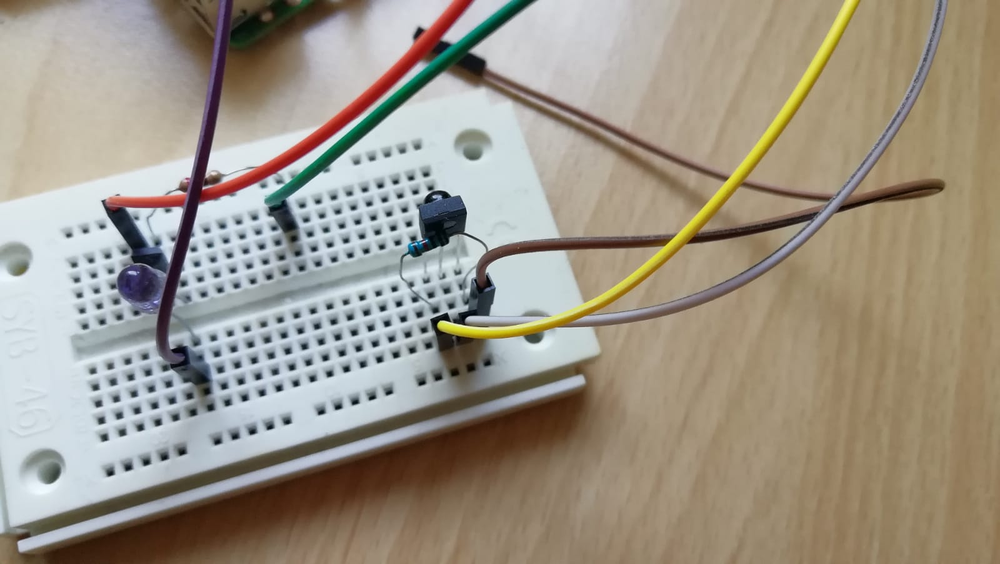
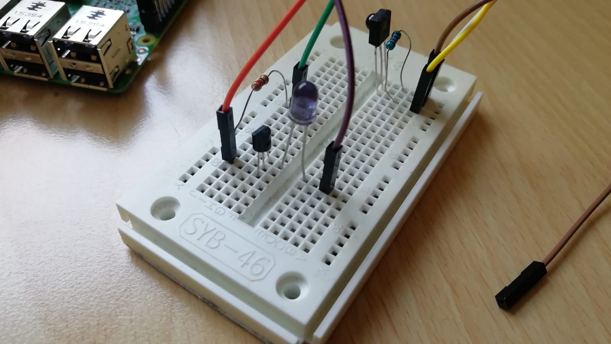
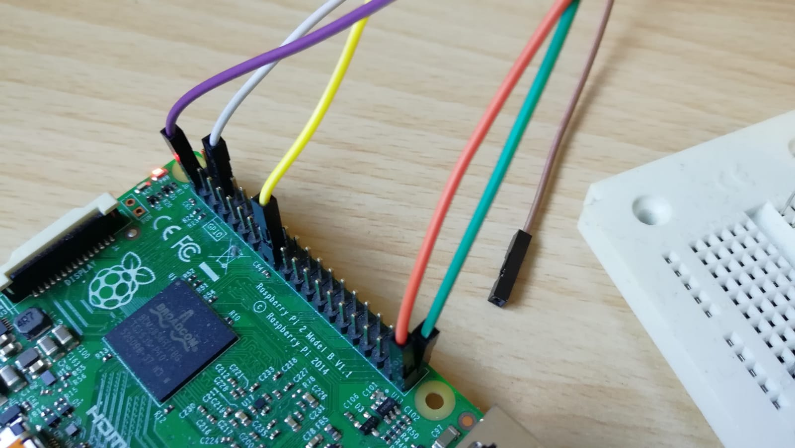

# Raspberry Pi RGB Led Strip Remote Control #

This project aims to control a RGB LED light strip using IR Sensor, Raspberry pi, Lirc, Python and an Android App.

as from Kernel 4.19.42-v7+

I use a Raspberry Pi 2 with Kernel Version 4.19.97-v7+ (You can check your Kernel using `uname -a`).

## Steps ##

1. Install and Configurate LIRC
2. Setup IR Sender and IR Receiver
3. Setup and run API with the help of Linux Screen
4. Install Android App
5. Ready


## 1. Install and Configurate LIRC ##

First of all the `/boot/config.txt` need to be edited.

`sudo nano /boot/config.txt`

In this file you add these lines and save file (CTRL+o):

`dtoverlay=gpio-ir,gpio_pin=21`
`dtoverlay=gpio-ir-tx,gpio_pin=21`

The first line is for receiving codes and the second line is for sending codes.
It's Important that you only comment in the line that you want to use. When you want to receive codes comment only the first line in otherwise it wouldn't work. 
The pin *21* will be important in step 2.

Next you install lirc with the following comands:

`sudo apt-get update`
`sudo apt-get install lirc`

Then you need to change some lines in the `/etc/lirc/lirc_options.conf` file (Hardware.conf didn't exists anymore):

```
[lircd]
driver = default
device = /dev/lirc0

[lircmd]
uinput = True
```

Now reboot your system

`sudo reboot`

## 2. Setup IR Sender and IR Receiver ##

### Components ###

- simple IR LED [Amazon](https://www.amazon.de/dp/B01DF5BXY8/ref=sr_1_9?dchild=1&keywords=ir+led&qid=1586185948&sr=8-9)
- 2 x 220 Ohm resistor
- NPN Bipolar Transistor. S9014 or similar. [Amazon](https://www.amazon.de/-/en/gp/product/B014I7U62M/ref=ppx_yo_dt_b_asin_image_o01_s00?ie=UTF8&psc=1)
- IR Receiver


Connect your IR Receiver and Sender like in the picture below. I use the same pin for receiving and sending, so if you want to switch the task you need to switch the cable, too.









When you have done this you can test your IR receiver (Dont forget to comment only `dtoverlay=gpio-ir,gpio_pin=21` in and change the cable to the right pin):

Stop lircd

`sudo /etc/init.d/lircd stop`

and start test programme

`mode2 -d /dev/lirc0`

Now you can press some buttons on your IR-Controller.

After you tested the IR-Receiver start lircd

`sudo /etc/init.d/lircd start`


### Record IR codes ###

In order to use the IR sender you must record codes from the IR Controller. I recorded the raw codes for [this](https://www.amazon.de/dp/B003WJ5PVK/ref=sr_1_6?crid=2Y52TWIQ80BWE&dchild=1&keywords=ir+controller&qid=1586187175&sprefix=ir+controller%2Caps%2C161&sr=8-6) Controller. You can find them [here](/lircd.conf).

```
sudo /etc/init.d/lircd stop
sudo irrecord -d /dev/lirc0 ~/lircd.conf
```
follow the instructions
at the end ~/lircd.conf file will be generated

Make a backup of the original lircd.conf in the case something went wrong

`sudo mv /etc/lirc/lircd.conf /etc/lirc/lircd_original.conf`

And override `lircd.conf`

`sudo cp ~/lircd.conf /etc/lirc/lircd.conf`

`sudo /etc/init.d/lircd start`


For me this didn't work (only get *0x0* behind codes) but I found a solution that works for me. I recorded raw_codes:

```
sudo /etc/init.d/lircd stop
sudo irrecord -f -d /dev/lirc0 ~/lircd.conf
```

You can test your IR-Sender by typing this:

```
sudo /etc/init.d/lircd
irsend SEND_ONCE [your-remote-name] [your-key-name] 
```


## 3. Setup and run API with the help of Linux Screen ##

Install git and clone this repository to your Raspberry Pi

`git clone https://github.com/martenjostmann/rgb-led-remote-control.git`

Change IP-Address in com.py file (LED-Control-API\ControllerClass\API\com.py) to your local Ip-Addresse of the Raspberry Pi

You need to setup a virtual environment to use the module flask which is important work with the API. I found a good explanation [here](https://linoxide.com/linux-how-to/install-flask-python-ubuntu/)
Another way to setup a virtual environment is to use Anaconda. I've provided an environment.yml

Now you can run the com.py file by navigating into the folder and type (The prerequisite for this is that you installed the latest version of python 3):

`python3 com.py`

To run this code in the Background of your Resparry Pi you can use the Screen feature:

```
apt-get install screen
screen python3 com.py
```

If you want to learn more about Linux Screen look up [this](https://linuxize.com/post/how-to-use-linux-screen/) site.


### 4. Install Android App ###

Last but not least install the App on your mobile phone and your ready to go.